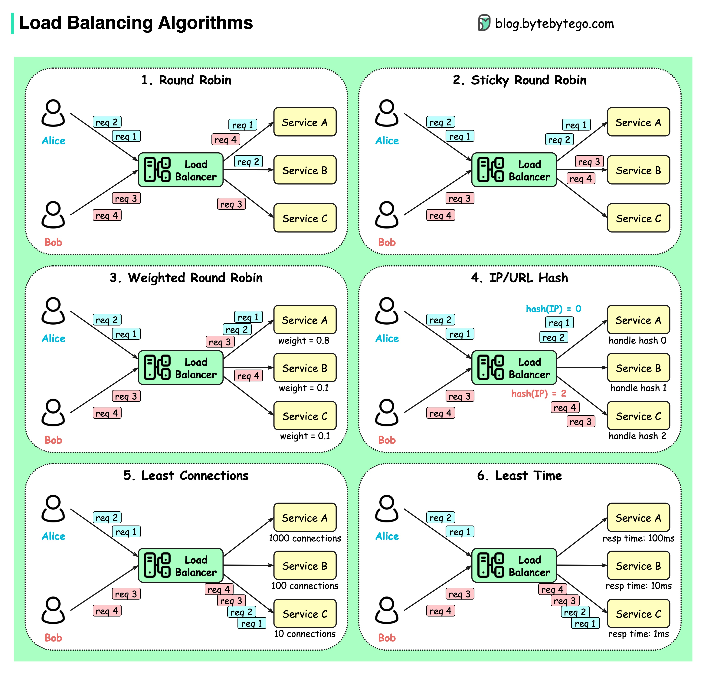

## What are the common load-balancing algorithms?
What are the common load-balancing algorithms?The diagram below shows 6 common algorithms.

  

Static AlgorithmsRound robinThe client requests are sent to different service instances in sequential order. The services are usually required to be stateless.Sticky round-robinThis is an improvement of the round-robin algorithm. If Alice’s first request goes to service A, the following requests go to service A as well.Weighted round-robinThe admin can specify the weight for each service. The ones with a higher weight handle more requests than others.HashThis algorithm applies a hash function on the incoming requests’ IP or URL. The requests are routed to relevant instances based on the hash function result.Dynamic AlgorithmsLeast connectionsA new request is sent to the service instance with the least concurrent connections.Least response timeA new request is sent to the service instance with the fastest response time.