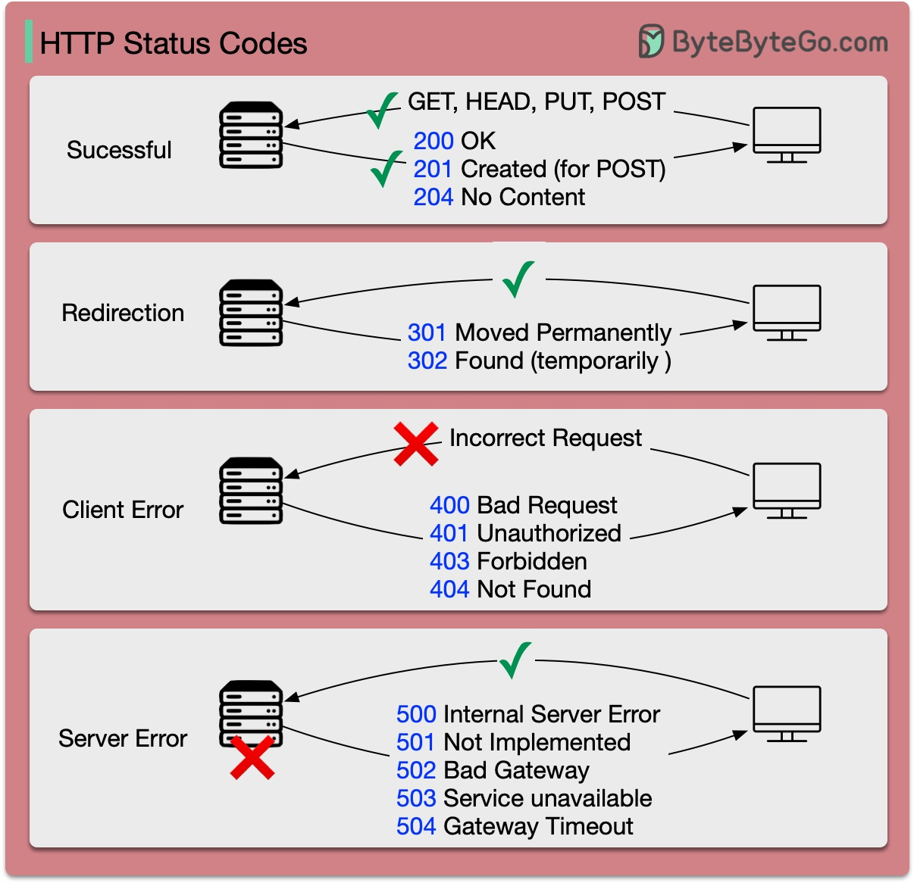

# HTTP status codes

  

The response codes for HTTP are divided into five categories:Informational (100-199) 
Success (200-299) 
Redirection (300-399) 
Client Error (400-499) 
Server Error (500-599)