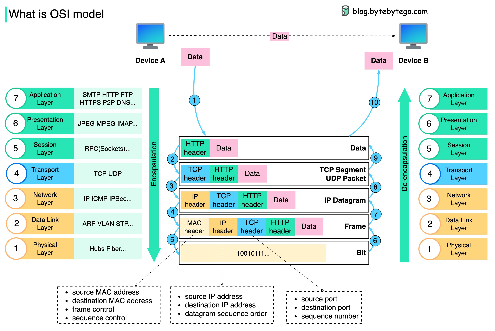

# TCP/IP 封装

数据是如何通过网络发送的？为什么 OSI 模型中需要这么多层？下面的图表显示了在网络传输时数据是如何封装和解封装的。第一步：当设备 A 通过 HTTP 协议通过网络向设备 B 发送数据时，首先在应用层添加一个 HTTP 头。第 2 步：然后在数据上添加 TCP 或 UDP 头。它在传输层被封装为 TCP 段。头部包含源端口、目的端口和序列号。第三步：然后在网络层使用 IP 头对分段进行封装。IP 头包含源/目的 IP 地址。第 4 步：在数据链路层为 IP 数据报添加了一个 MAC 头，带有源/目的 MAC 地址。第 5 步：封装的帧被发送到物理层，并以二进制位的形式通过网络发送。步骤 6-10：当设备 B 从网络接收到比特时，它执行去封装过程，这是封装过程的逆向处理。头部逐层移除，最终，设备 B 可以读取数据。我们在网络模型中需要层次结构，因为每一层都专注于自己的职责。每一层可以依赖头部信息进行处理指令，而不需要了解上一层数据的含义。