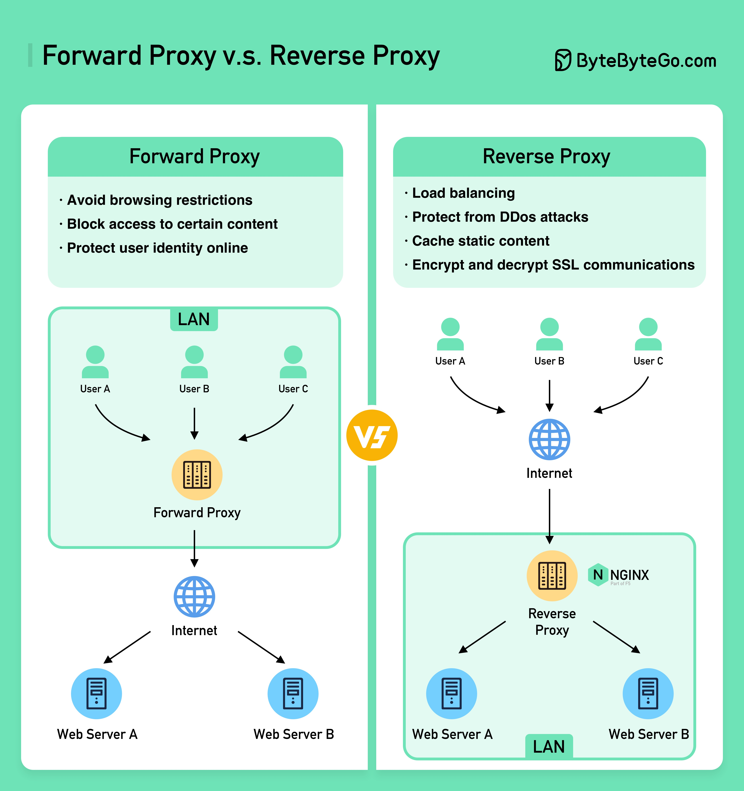

# 为什么 Nginx 被称为“反向”代理？

下面的图表显示了一个前向协议和一个反向协议之间的区别。正向代理是一台位于用户设备和互联网之间的服务器。前向代理通常用于：保护客户规避浏览限制阻止访问特定内容反向代理是一台服务器，它接受来自客户端的请求，将请求转发给 Web 服务器，并将结果返回给客户端，就好像代理服务器处理了该请求一样。反向代理适用于：保护服务器负载均衡缓存静态内容加密和解密 SSL 通信