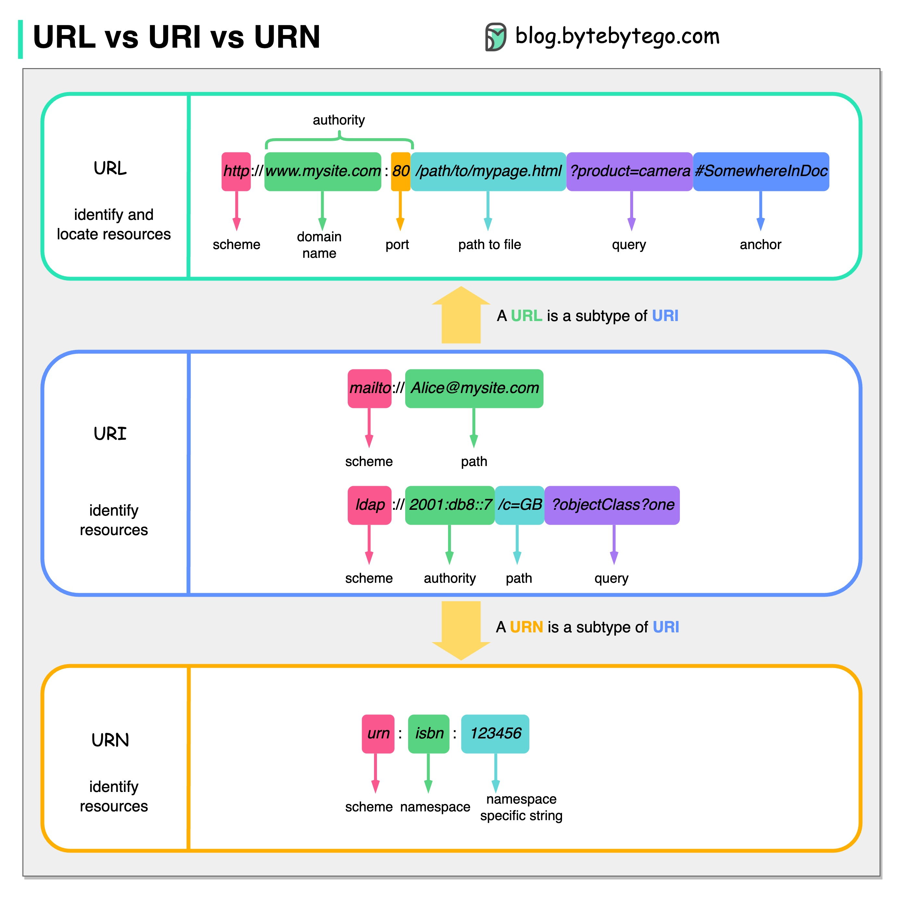

# URL、URI、URN - 你知道它们之间的区别吗？

下图显示了URL、URI和URN的比较。

  

- URI

URI代表统一资源标识符。它标识Web上的逻辑或物理资源。URL和URN是URI的子类型。URL用于定位资源，而URN则用于命名资源。

URI由以下部分组成：
scheme:[//authority]path[?query][#fragment]

- URL

URL代表统一资源定位符，是HTTP的关键概念。它是Web上唯一资源的地址。它还可以与其他协议一起使用，如FTP和JDBC。

- URN

URN代表统一资源名称。它使用urn格式。URN不能用于定位资源。图中给出的一个简单示例由命名空间和特定于命名空间的字符串组成。

如果您想了解有关该主题的更多详细信息，我建议您查看[W3C的澄清](https://www.w3.org/TR/uri-clarification/)。