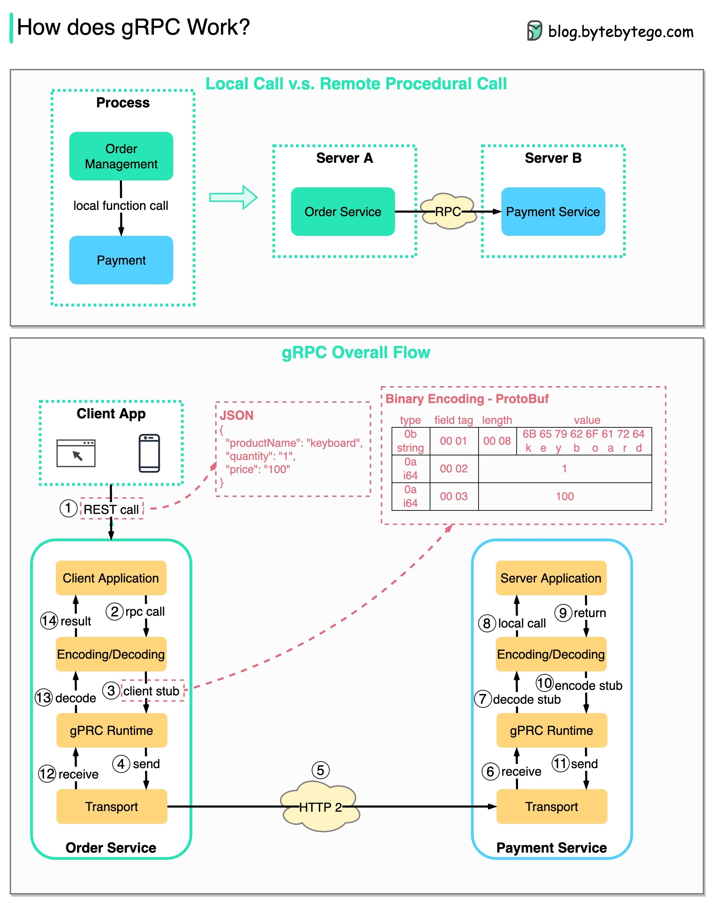

# gRPC是如何工作的？

RPC（远程过程调用）之所以称为“**远程**”，是因为它在微服务架构中允许部署在不同服务器上的远程服务之间进行通信。从用户的角度来看，它就像本地函数调用一样。

下图说明了**gRPC**的整体数据流。

  

步骤1：从客户端发起REST调用。请求体通常为JSON格式。

步骤2 - 4：订单服务（gRPC客户端）接收REST调用，转换并向支付服务发起RPC调用。gRPC将**客户端存根**编码为二进制格式，并将其发送到底层传输层。

步骤5：gRPC通过HTTP2将数据包发送到网络。由于二进制编码和网络优化，gRPC被认为比JSON快5倍。

步骤6 - 8：支付服务（gRPC服务器）从网络中接收数据包，解码它们并调用服务器应用。

步骤9 - 11：结果从服务器应用返回，并被编码并发送到传输层。

步骤12 - 14：订单服务接收数据包，解码它们，并将结果发送给客户端应用。