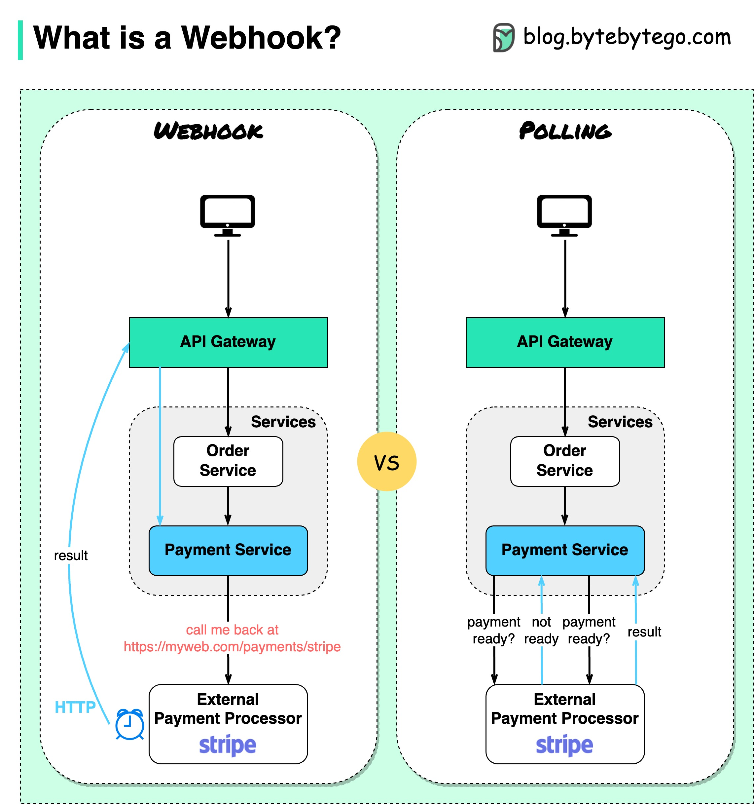

# 什么是 Webhook？

下面的图表显示了轮询和 Webhook 之间的比较。假设我们经营一家电子商务网站。客户通过 API 网关将订单发送到订单服务，订单服务将订单发送到支付服务进行支付交易。支付服务然后与外部支付服务提供商（PSP）进行通信，以完成交易。处理与外部 PSP 的通信有两种方式。**1. 短轮询**将付款请求发送给 PSP 后，支付服务不断向 PSP 询问付款状态。经过几轮后，PSP 最终返回了状态。短轮询有两个缺点：状态的持续轮询需要支付服务的资源。外部服务直接与支付服务通信，造成安全漏洞。**2. Webhook Webhook**我们可以向外部服务注册一个 Webhook。这意味着：当您有关于请求的更新时，请在特定的 URL 上回调我。当 PSP 完成处理后，它将调用 HTTP 请求来更新付款状态。这样一来，编程范式发生了变化，支付服务不再需要浪费资源来轮询支付状态。如果 PSP 从不回拨怎么办？我们可以设置一个家政工作，每小时检查付款状态。Webhooks 通常被称为反向 API 或推送 API，因为服务器向客户端发送 HTTP 请求。在使用 webhook 时，我们需要注意 3 件事：我们需要为外部服务设计一个合适的 API 来调用。出于安全原因，我们需要在 API 网关中建立适当的规则。我们需要在外部服务上注册正确的 URL。