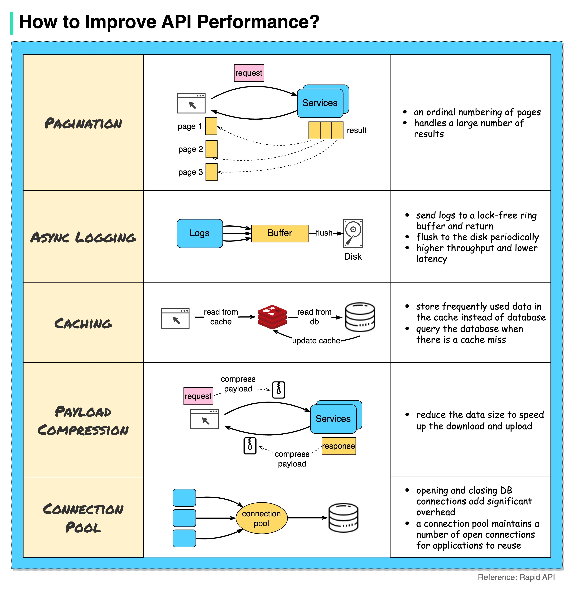

如何提高 API 性能？下面的图表显示了 5 种常见的提高 API 性能的技巧。分页这是在结果大小较大时的常见优化。结果会以流式传输的方式返回给客户端，以提高服务的响应速度。异步记录同步记录处理每次调用都会涉及磁盘，可能会减慢系统速度。异步记录首先将日志发送到无锁缓冲区，然后立即返回。日志将定期刷新到磁盘，这显著减少了 I/O 开销。缓存我们可以将经常访问的数据存储到缓存中。客户端可以首先查询缓存，而不是直接访问数据库。如果缓存未命中，客户端可以从数据库查询。像 Redis 这样的缓存将数据存储在内存中，因此数据访问比数据库快得多。负载压缩请求和响应可以使用 gzip 等进行压缩，从而传输的数据大小要小得多。这样可以加快上传和下载速度。连接池在访问资源时，我们经常需要从数据库加载数据。打开和关闭数据库连接会增加很大的开销。因此，我们应该通过一个打开连接的连接池连接到数据库。连接池负责管理连接的生命周期。