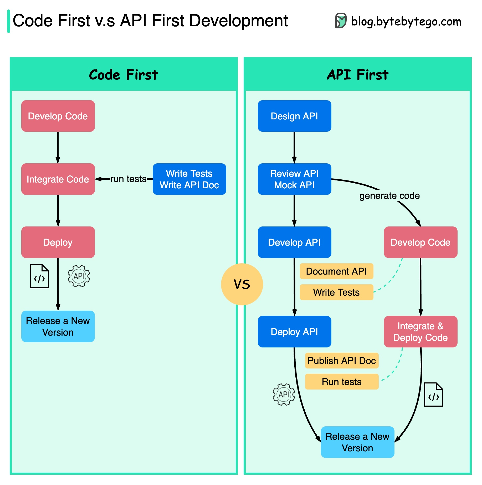

# 代码优先 vs. API 优先

下面的图表显示了先编码开发和先 API 开发之间的区别。为什么我们要考虑先 API 设计呢？微服务增加了系统的复杂性，我们有单独的服务来提供系统的不同功能。虽然这种架构有助于解耦和职责分离，但我们需要处理各个服务之间的通信。最好在编写代码之前仔细思考系统的复杂性，并仔细定义服务的边界。独立的功能团队需要说同一种语言，专门的功能团队只负责自己的组件和服务。建议组织通过 API 设计说同一种语言。我们可以模拟请求和响应来验证 API 设计是否正确，然后再编写代码。提高软件质量和开发人员的生产力。由于我们在项目开始时已经解决了大部分不确定性，整个开发过程更加顺利，软件质量得到了极大的提升。开发人员也对这个过程感到高兴，因为他们可以专注于功能开发，而不是谈判突然的变化。项目生命周期末期出现意外的可能性降低了。因为我们首先设计了 API，所以在开发代码的同时可以设计测试。在某种程度上，当使用 API 优先开发时，我们也在进行 TDD（测试驱动设计）。