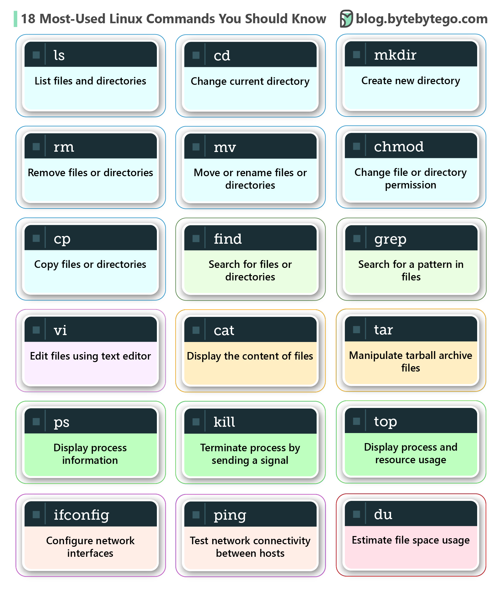

# 18 个你应该知道的最常用的 Linux 命令

Linux 命令是与操作系统交互的指令。它们帮助管理文件、目录、系统进程以及系统的许多其他方面。为了有效地浏览和维护基于 Linux 的系统，您需要熟悉这些命令。下面的图表显示了流行的 Linux 命令：ls - 列出文件和目录cd - 更改当前目录创建一个新目录rm - 删除文件或目录cp - 复制文件或目录mv - 移动或重命名文件或目录chmod - 更改文件或目录权限grep - 在文件中搜索模式查找 - 搜索文件和目录tar - 操作 tarball 存档文件vi - 使用文本编辑器编辑文件猫 - 显示文件内容顶部 - 显示进程和资源使用ps - 显示进程信息杀死 - 通过发送信号终止进程du - 估算文件空间使用量ifconfig - 配置网络接口ping - 测试主机之间的网络连接