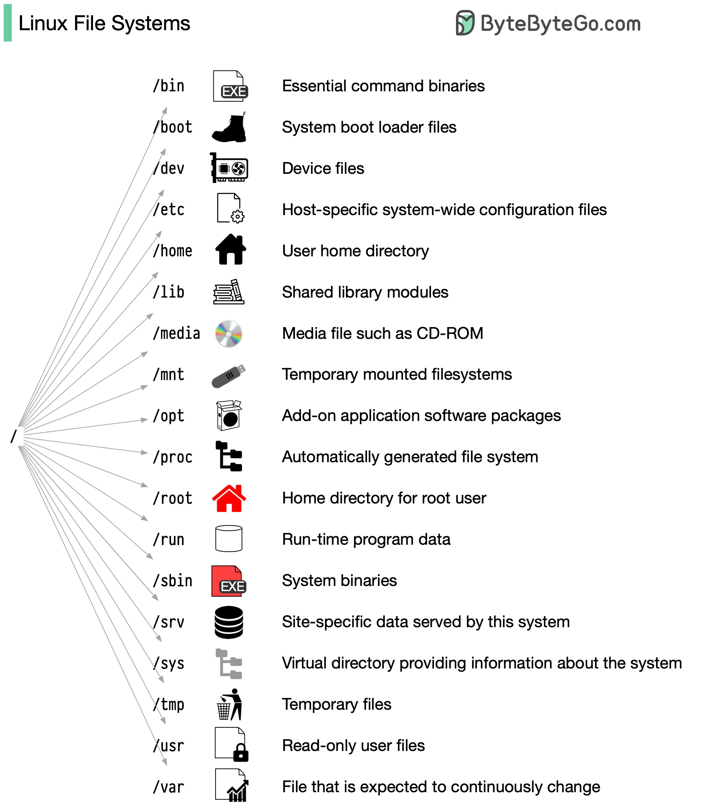

Linux 文件系统解释Linux 文件系统曾经类似于一个无组织的城镇，个人可以随意在任何地方建造他们的房屋。然而，1994 年引入了文件系统层次结构标准（FHS），以整顿 Linux 文件系统。通过实施像 FHS 这样的标准，软件可以确保在各种 Linux 发行版中保持一致的布局。然而，并非所有 Linux 发行版严格遵循这一标准。它们经常会融入自己独特的元素或迎合特定需求。要精通这一标准，您可以从探索开始。利用诸如“cd”用于导航和“ls”用于列出目录内容的命令。将文件系统想象成一棵树，从根目录（/）开始。随着时间的推移，这将变得自然而然，将您转变为一名熟练的 Linux 管理员。