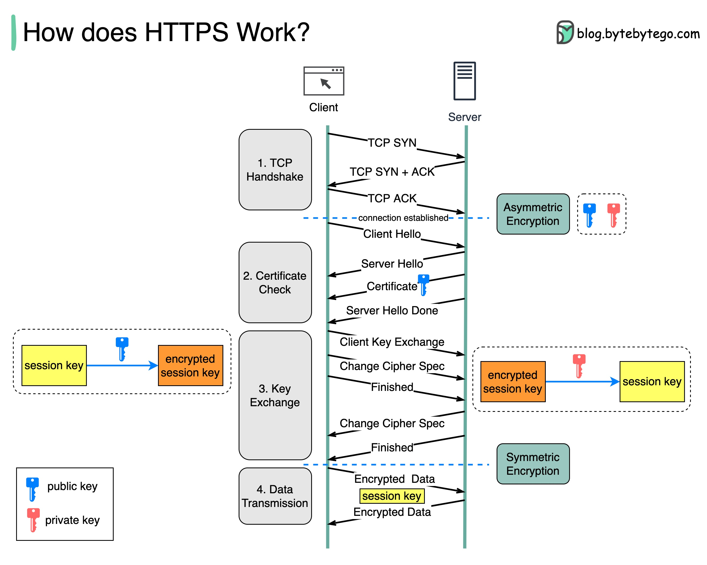

# HTTPS 是如何工作的？

超文本传输安全协议（HTTPS）是超文本传输协议（HTTP）的扩展。HTTPS 使用传输层安全性（TLS）传输加密数据。如果数据在网上被劫持，劫持者只能获得二进制代码。数据是如何加密和解密的？第一步 - 客户端（浏览器）和服务器建立 TCP 连接。第 2 步 - 客户端向服务器发送“客户端 hello”。 该消息包含一组必要的加密算法（密码套件）和它可以支持的最新 TLS 版本。 服务器以“服务器 hello”作出响应，以便浏览器知道它是否可以支持这些算法和 TLS 版本。服务器然后将 SSL 证书发送给客户端。证书包含公钥、主机名、到期日期等信息。客户端验证证书。第三步 - 在验证 SSL 证书后，客户端生成一个会话密钥并使用公钥对其进行加密。服务器接收加密的会话密钥并使用私钥解密。第 4 步 - 现在客户端和服务器都持有相同的会话密钥（对称加密），加密数据通过安全的双向通道传输。为什么 HTTPS 在数据传输过程中会切换到对称加密？主要有两个原因：安全性：非对称加密只能单向进行。这意味着如果服务器尝试将加密数据发送回客户端，任何人都可以使用公钥解密数据。服务器资源：非对称加密增加了相当多的数学开销。它不适用于长时间会话中的数据传输。