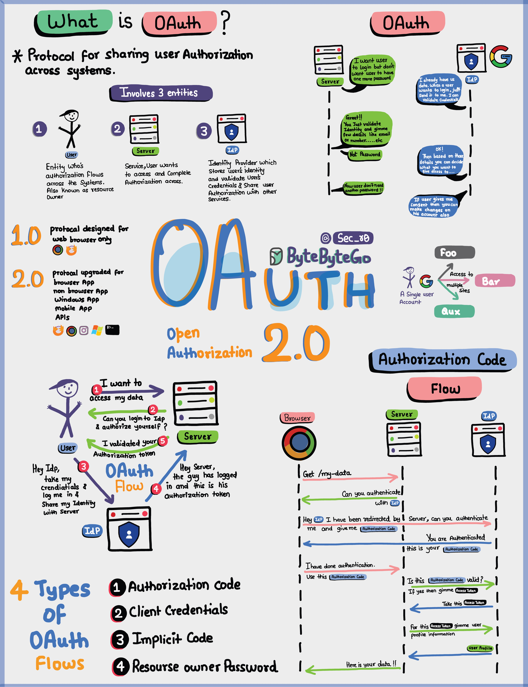

使用简单术语解释的 Oauth 2.0。OAuth 2.0 是一个强大且安全的框架，允许不同的应用程序代表用户安全地相互交互，而无需共享敏感凭据。OAuth 涉及的实体是用户、服务器和身份提供者（IDP）。OAuth 令牌可以做什么？当您使用 OAuth 时，您会获得一个代表您身份和权限的 OAuth 令牌。这个令牌可以做一些重要的事情：单点登录（SSO）：使用 OAuth 令牌，您可以仅使用一个登录即可登录多个服务或应用程序，使生活更加简单和安全。系统间授权：OAuth 令牌允许您在各个系统之间共享授权或访问权限，这样您就不必到处单独登录。访问用户资料：具有 OAuth 令牌的应用程序可以访问您允许的用户资料的某些部分，但它们不会看到所有内容。请记住，OAuth 2.0 的目的是在确保您和您的数据安全的同时，使您在不同的应用程序和服务之间的在线体验变得无缝和无忧。