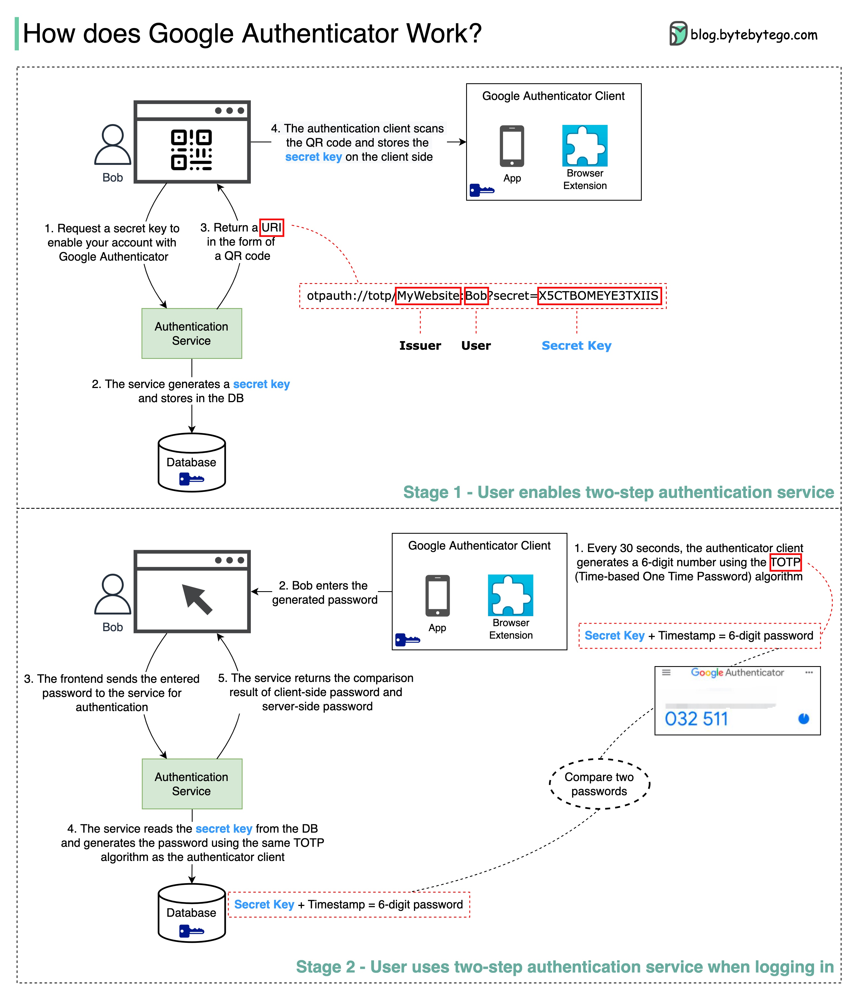

Google Authenticator（或其他类型的双因素认证器）是如何工作的？Google Authenticator 通常用于在启用两步验证时登录我们的帐户。它如何保证安全？Google Authenticator 是一种基于软件的身份验证器，实现了两步验证服务。下面的图表提供了详细信息。有两个阶段涉及：阶段 1 - 用户启用谷歌两步验证。阶段 2 - 用户使用身份验证器进行登录等操作。让我们来看看这些阶段。**阶段 1**步骤 1 和 2：Bob 打开网页以启用两步验证。前端请求一个秘钥。认证服务为 Bob 生成秘钥并将其存储在数据库中。第三步：认证服务返回一个 URI 给前端。该 URI 由密钥发行者、用户名和秘钥组成。该 URI 以 QR 码的形式显示在网页上。第四步：Bob 然后使用 Google Authenticator 扫描生成的 QR 码。密钥存储在验证器中。**第 2 阶段** 步骤 1 和 2：Bob 想要使用 Google 两步验证登录网站。为此，他需要密码。每 30 秒，Google Authenticator 使用 TOTP（基于时间的一次性密码）算法生成一个 6 位数密码。Bob 使用密码进入网站。步骤 3 和 4：前端将 Bob 输入的密码发送到后端进行身份验证。身份验证服务从数据库中读取密钥，并使用与客户端相同的 TOTP 算法生成一个 6 位密码。第 5 步：认证服务比较客户端和服务器生成的两个密码，并将比较结果返回给前端。只有当这两个密码匹配时，Bob 才能继续登录过程。这个认证机制安全吗？其他人能获取到秘钥吗？我们需要确保使用 HTTPS 传输密钥。认证客户端和数据库存储密钥，我们需要确保密钥被加密。黑客能猜到 6 位密码吗？不。密码有 6 位数字，因此生成的密码有 100 万种可能的组合。另外，密码每 30 秒更改一次。如果黑客想在 30 秒内猜出密码，他们需要每秒输入 30,000 种组合。