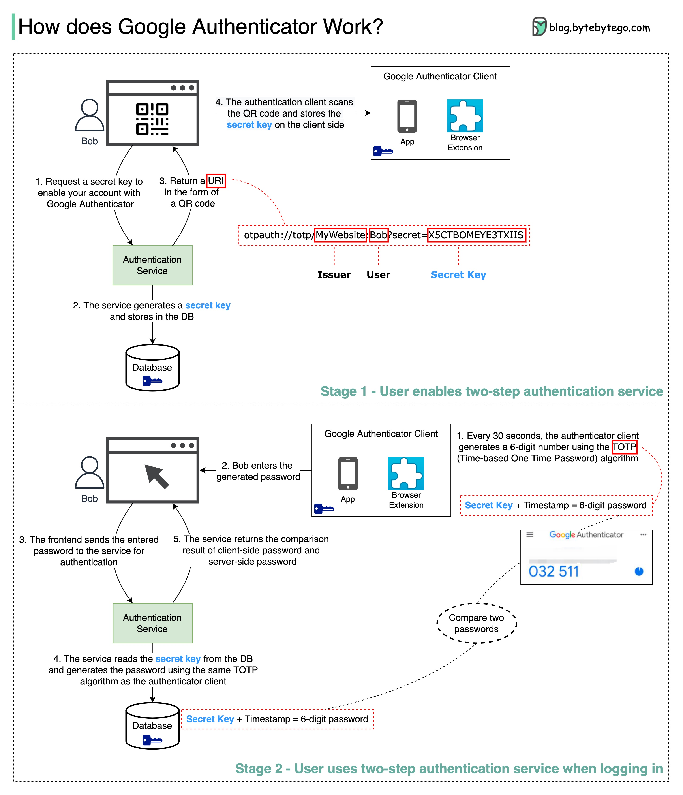

# Google Authenticator（或其他类型的双因素身份验证器）是如何工作的？

Google Authenticator常用于在启用双因素身份验证时登录我们的账户。它如何保证安全？

Google Authenticator是一种基于软件的身份验证器，实施了两步验证服务。下面的图表提供了详细信息。

  

涉及两个阶段：

- 阶段1 - 用户启用Google两步验证。
- 阶段2 - 用户使用身份验证器进行登录等。

让我们看一下这些阶段。

**阶段1**

步骤1和2：鲍勃打开网页以启用两步验证。前端请求一个秘密密钥。身份验证服务为鲍勃生成秘密密钥并将其存储在数据库中。

步骤3：身份验证服务将URI返回给前端。URI由key issuer、username和secret key组成。URI以二维码的形式显示在网页上。

步骤4：鲍勃随后使用Google Authenticator扫描生成的二维码。秘密密钥存储在身份验证器中。

**第二阶段**

步骤 1 和 2：博比想用 Google 两步身份验证登录一个网站。为此，他需要密码。每 30 秒，Google Authenticator 使用 TOTP（基于时间的一次性密码）算法生成一个 6 位数字的密码。博比使用这个密码登录网站。

步骤 3 和 4：前端将博比输入的密码发送到后端进行身份验证。身份验证服务从数据库中读取密钥，并使用与前端相同的 TOTP 算法生成一个 6 位数字的密码。

步骤 5：身份验证服务将客户端和服务器生成的两个密码进行比较，并将比较结果返回给前端。博比只有在两个密码匹配的情况下才能继续登录。

这种身份验证机制安全吗？

- 密钥会被别人盗取吗？

    我们需要确保密钥是通过 HTTPS 传输的。身份验证器应用和数据库存储密钥，我们需要确保密钥被加密。

- 6 位数字的密码会被黑客猜到吗？

    不会。密码有 6 位，因此生成的密码有 100 万种可能的组合。此外，密码每 30 秒会变动一次。如果黑客想在 30 秒内猜出密码，他们需要每秒尝试 30,000 种组合。