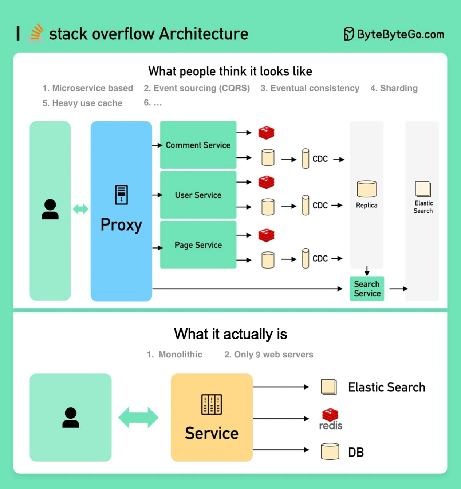

# 你将如何设计 Stack Overflow 网站？

如果您的答案是本地服务器和单体（在下图底部），您很可能会在面试中失败，但这就是现实中的情况！**  
人们认为它应该是什么样子**面试官可能期望看到图片的顶部部分。微服务用于将系统分解为小组件。每个服务都有自己的数据库。大量使用缓存。服务已分片。服务通过消息队列异步地相互通信。该服务使用事件溯源和 CQRS 实现。展示在分布式系统中的知识，比如最终一致性、CAP 理论等。**它实际上是什么**Stack Overflow 仅使用 9 台本地 Web 服务器处理所有流量，并且它是单体架构！它拥有自己的服务器，不在云上运行。这与我们当今所有流行的信念相悖。