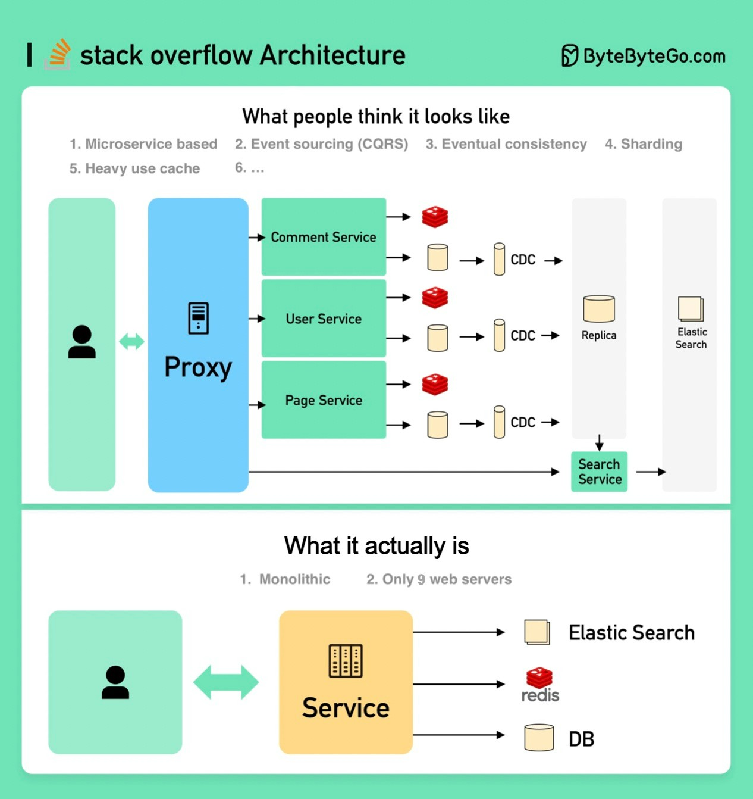

## How will you design the Stack Overflow website?
How will you design the Stack Overflow website?If your answer is on-premise servers and monolith (on the bottom of the following image), you would likely fail the interview, but that's how it is built in reality!

  

**What people think it should look like**The interviewer is probably expecting something like the top portion of the picture.Microservice is used to decompose the system into small components.Each service has its own database. Use cache heavily.The service is sharded.The services talk to each other asynchronously through message queues.The service is implemented using Event Sourcing with CQRS.Showing off knowledge in distributed systems such as eventual consistency, CAP theorem, etc.**What it actually is**Stack Overflow serves all the traffic with only 9 on-premise web servers, and it’s on monolith! It has its own servers and does not run on the cloud.This is contrary to all our popular beliefs these days.