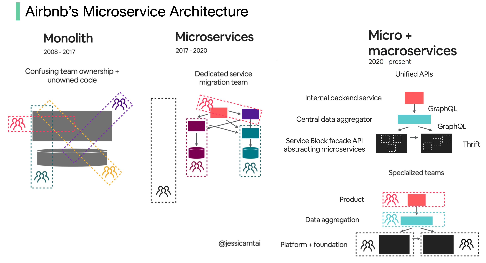

# Evolution of Airbnb’s microservice architecture over the past 15 years

Airbnb’s microservice architecture went through 3 main stages.

  

Monolith (2008 - 2017)Airbnb began as a simple marketplace for hosts and guests. This is built in a Ruby on Rails application - the monolith.What’s the challenge?Confusing team ownership + unowned codeSlow deploymentMicroservices (2017 - 2020)Microservice aims to solve those challenges. In the microservice architecture, key services include:Data fetching serviceBusiness logic data serviceWrite workflow serviceUI aggregation serviceEach service had one owning teamWhat’s the challenge?Hundreds of services and dependencies were difficult for humans to manage.Micro + macroservices (2020 - present)This is what Airbnb is working on now. The micro and macroservice hybrid model focuses on the unification of APIs.