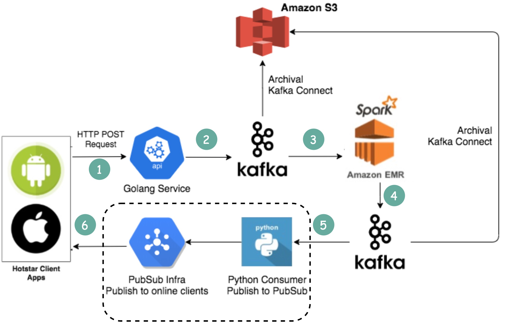

# How does Disney Hotstar capture 5 Billion Emojis during a tournament?

  

Clients send emojis through standard HTTP requests. You can think of Golang Service as a typical Web Server. Golang is chosen because it supports concurrency well. Threads in Golang are lightweight.Since the write volume is very high, Kafka (message queue) is used as a buffer.Emoji data are aggregated by a streaming processing service called Spark. It aggregates data every 2 seconds, which is configurable. There is a trade-off to be made based on the interval. A shorter interval means emojis are delivered to other clients faster but it also means more computing resources are needed.Aggregated data is written to another Kafka.The PubSub consumers pull aggregated emoji data from Kafka.Emojis are delivered to other clients in real-time through the PubSub infrastructure. The PubSub infrastructure is interesting. Hotstar considered the following protocols: Socketio, NATS, MQTT, and gRPC, and settled with MQTT.A similar design is adopted by LinkedIn which streams a million likes/sec.