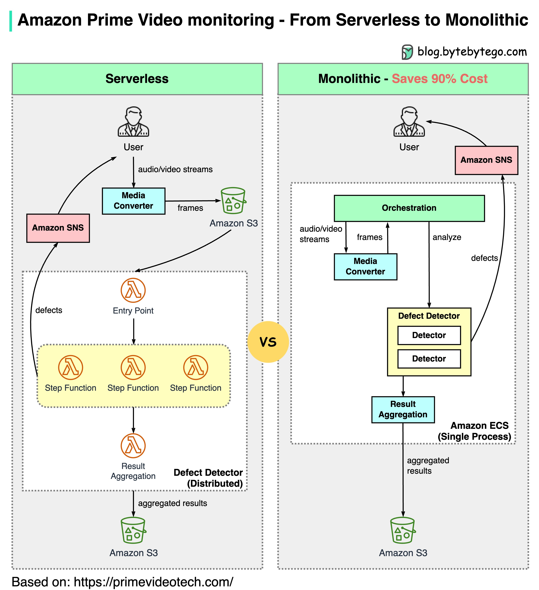

# 为什么亚马逊Prime视频监控从无服务器转向单体？如何节省90%的成本？

下面的图表显示了迁移前后的架构比较。

  

什么是亚马逊Prime视频监控服务？

Prime视频服务需要监控数千个实时流的质量。监控工具会实时自动分析流并识别质量问题，如块损坏、视频冻结和同步问题。这是客户满意度的重要过程。

有3个步骤：媒体转换器、缺陷检测器和实时通知。

- 旧架构有什么问题？

  旧架构基于亚马逊Lambda，这对于快速构建服务来说很好。然而，当以大规模运行该架构时，它并不经济。两项最昂贵的操作是：

1. 编排工作流——AWS步骤函数按状态转换向用户收费，而编排每秒执行多个状态转换。

2. 分布式组件之间的数据传递——中间数据存储在亚马逊S3中，以便下一阶段下载。当量很大时，下载可能会很昂贵。

- 单体架构节省90%成本

  单体架构旨在解决成本问题。仍然有3个组件，但媒体转换器和缺陷检测器部署在同一进程中，节省了数据传输的成本。令人惊讶的是，这种部署架构的变化导致了90%的成本节省！

这是一个有趣而独特的案例研究，因为微服务已成为技术行业的首选和流行选择。看到我们更多地讨论架构的演变以及对其利弊进行更诚实的讨论是件好事。将组件分解为分布式微服务是有成本的。

- 亚马逊领导对此有什么看法？

  亚马逊首席技术官Werner Vogels：“构建**evolvable 软件系统**是一种战略，而不是一种宗教。以开放的心态重新审视你的架构是必须的。”

  前亚马逊副总裁可持续性Adrian Cockcroft：“Prime视频团队遵循了一条我称之为**无服务器优先**的路径……我并不提倡**仅无服务器**。”