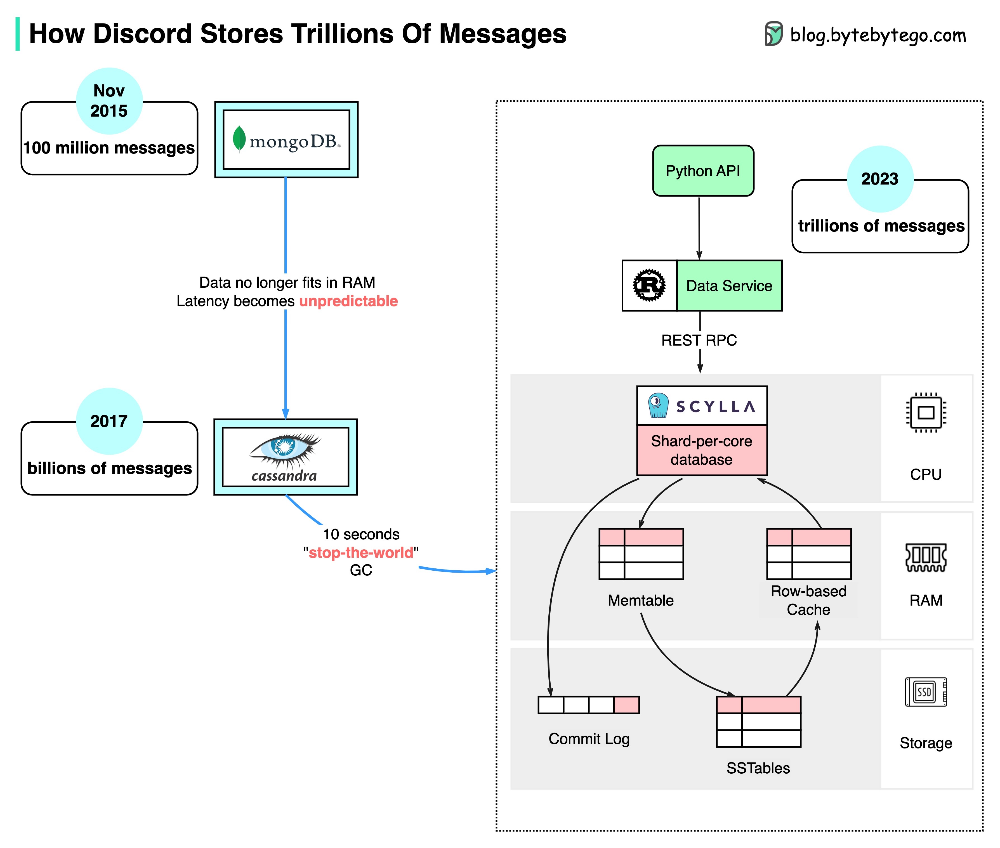

# Discord如何存储万亿条信息

下面的图表展示了Discord消息存储的演变：

  

MongoDB ➡️ Cassandra ➡️ ScyllaDB

2015年，Discord的第一个版本建立在单个MongoDB副本之上。大约在2015年11月，MongoDB存储了一亿条消息，RAM再也无法容纳数据和索引。延迟变得不可预测。消息存储被迁移到另一个数据库。于是选择了Cassandra。

2017年，Discord有12个Cassandra节点，存储了数十亿条消息。

到2022年初，它有177个节点，存储了万亿条消息。在这一点上，延迟变得不可预测，维护操作变得过于昂贵。

这些问题的原因有几个：

- Cassandra使用LSM树作为内部数据结构。读取的开销高于写入。在一个拥有数百用户的服务器上可能会有许多并发读取，导致热点。
- 维护集群，例如压缩SSTables，会影响性能。
- 垃圾回收暂停会导致显著的延迟峰值。

ScyllaDB是兼容Cassandra的数据库，用C++编写。Discord重新设计了其架构，以实现单体API、用Rust编写的数据服务和基于ScyllaDB的存储。

ScyllaDB中的p99读取延迟为15毫秒，而Cassandra中为40-125毫秒。p99写入延迟为5毫秒，而Cassandra中为5-70毫秒。