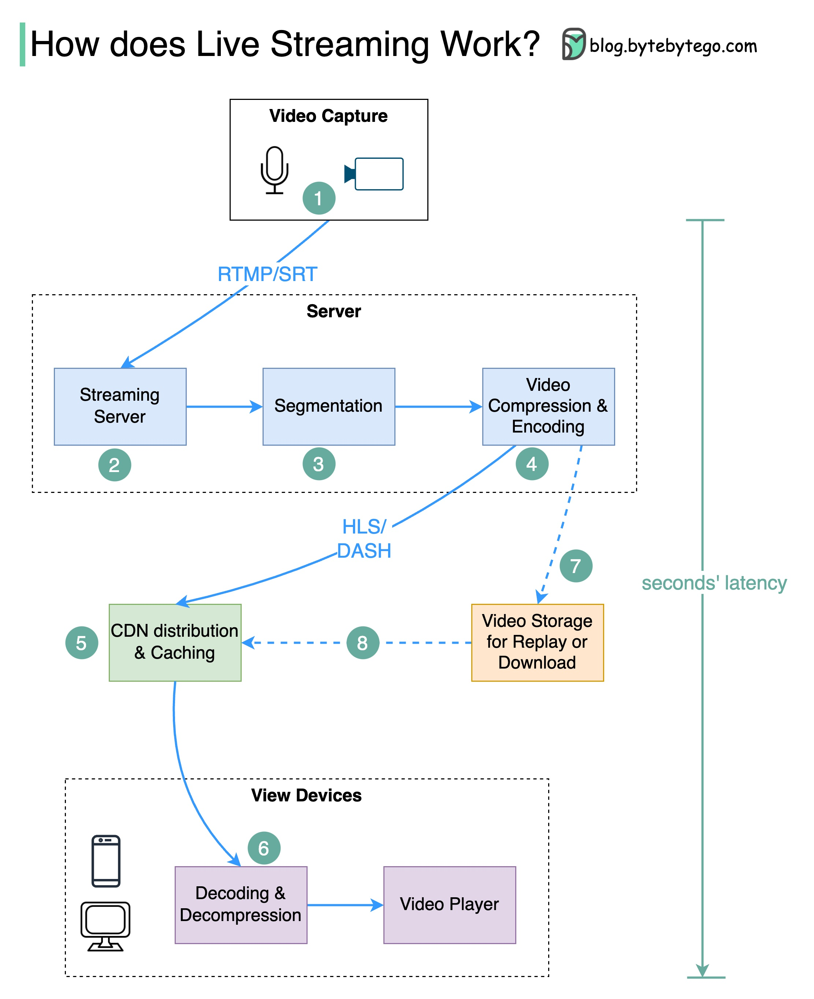

# YouTube、TikTok直播或Twitch上的视频直播是如何工作的？

直播与常规流媒体不同，因为视频内容通过互联网实时发送，通常延迟仅为几秒钟。

下面的图表解释了在后台发生了什么，使这一切成为可能。

  

步骤1：原始视频数据通过麦克风和摄像机捕获。数据被发送到服务器端。

步骤2：视频数据被压缩和编码。例如，压缩算法将背景和其他视频元素分开。压缩后，视频被编码为H.264等标准。经过此步骤后，视频数据的大小要小得多。

步骤3：编码后数据被划分为较小的段，通常长度为几秒，这样下载或流式传输所需时间大大减少。

步骤4：分段数据被发送到流媒体服务器。流媒体服务器需要支持不同的设备和网络条件。这称为“自适应比特率流”。这意味着在步骤2和3中我们需要生成不同比特率的多个文件。

步骤5：直播数据被推送到由CDN（内容分发网络）支持的边缘服务器。数百万观众可以从附近的边缘服务器观看视频。CDN显著降低了数据传输延迟。

步骤6：观众的设备解码和解压缩视频数据，并在视频播放器中播放视频。

步骤7和8：如果视频需要存储以供回放，编码后的数据将被发送到存储服务器，观众可以稍后向其请求回放。

直播的标准协议包括：

- RTMP（实时消息传输协议）：最初由Macromedia开发，用于在Flash播放器和服务器之间传输数据。目前主要用于互联网视频流媒体传输。请注意，像Skype这样的在线视频会议应用程序使用RTC（实时通信）协议以降低延迟。

- HLS（HTTP直播流）：它需要H.264或H.265编码。苹果设备仅支持HLS格式。

- DASH（基于HTTP的动态自适应流）：DASH不支持苹果设备。

- HLS和DASH都支持自适应码率流。