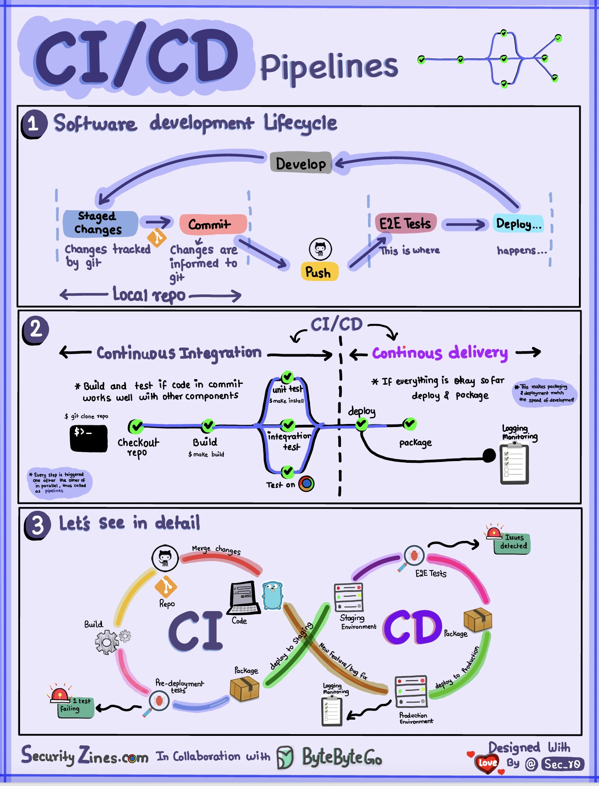

# CI/CD管道的简单解释

  

第1部分 - 带有CI/CD的软件开发生命周期（SDLC）

软件开发生命周期（SDLC）包含多个关键阶段：开发、测试、部署和维护。CI/CD自动化并集成这些阶段，以实现更快和更可靠的发布。

当代码提交到git仓库时，该操作会触发自动化构建和测试过程。运行E2E（端到端）测试用例以验证代码。如果测试通过，代码可以自动部署到预生产/生产环境。如果发现问题，代码将返回开发环节进行错误修复。自动化流程能快速为开发人员提供反馈，并减少了生产环境中出现错误的风险。

第二节 - CI与CD的区别

持续集成（CI）自动化构建、测试和合并过程。每当有代码提交时，它就会运行测试，以便及早发现集成问题。这鼓励频繁的代码提交和快速反馈。

持续交付（CD）自动化基础设施变更和部署等发布过程。通过自动化工作流程，确保软件可以随时可靠地发布。CD还可以自动化发布到生产环境前所需的手动测试和审批步骤。

第三节 - CI/CD流水线

一个典型的CI/CD流水线有几个连接的阶段：
- 开发者将代码更改提交到源控制 - CI服务器检测到更改并触发构建 - 代码被编译并测试（单元测试、集成测试） - 测试结果报告给开发者 - 成功时，构件部署到预生产环境 - 在发布之前，可能在预生产环境中进行进一步的测试 - CD系统将批准的更改部署到生产环境