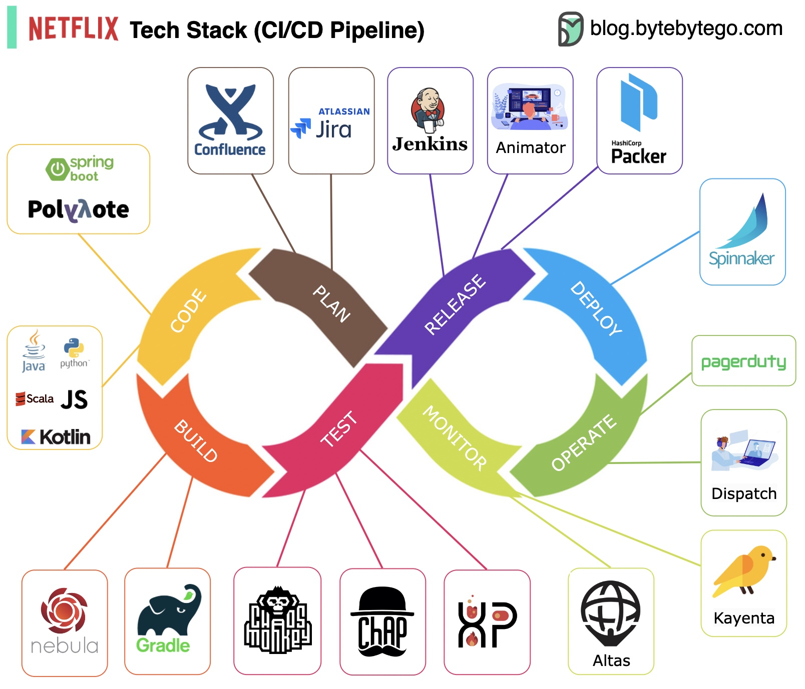

# Netflix 技术栈（CI/CD 流水线）

规划：Netflix 工程部门使用 JIRA 进行规划，使用 Confluence 进行文档编写。编码：Java 是后端服务的主要编程语言，而其他语言用于不同的用例。构建：Gradle 主要用于构建，Gradle 插件是为了支持各种用例而构建的。打包：包和依赖项被打包到一个亚马逊机器映像（AMI）中以供发布。测试：测试强调了生产文化对建立混乱工具的关注。部署：Netflix 使用其自建的 Spinnaker 进行金丝雀发布部署。监控：监控指标集中在 Atlas 中，Kayenta 用于检测异常。事件报告：根据优先级分派事件，并使用 PagerDuty 进行事件处理。