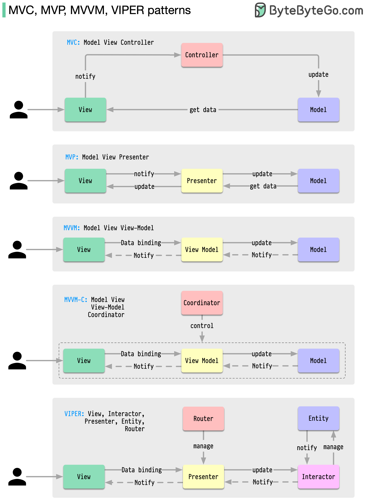

MVC，MVP，MVVM，MVVM-C 和 VIPER这些架构模式是在应用程序开发中最常用的，无论是在 iOS 还是 Android 平台上。开发人员已经引入它们来克服早期模式的局限性。那么，它们有什么不同呢？MVC，最古老的模式，可以追溯到近 50 年前每个模式都有一个“视图”（V）负责显示内容并接收用户输入大多数模式包括一个“模型”（M）来管理业务数据"Controller," "presenter," 和 "view-model" 是在视图和模型（在 VIPER 模式中称为 "entity"）之间进行调解的翻译器