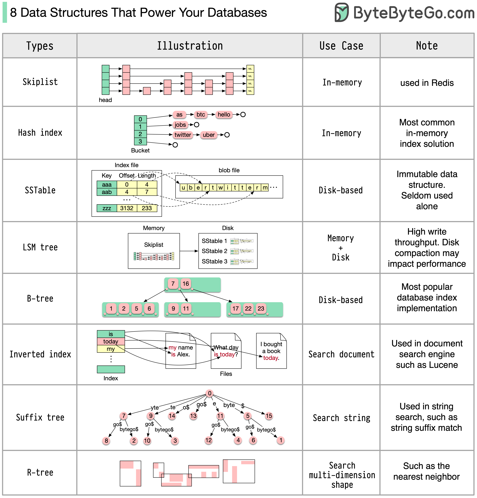

# 驱动您数据库的 8 种数据结构

答案会根据您的用例而有所不同。数据可以在内存中或磁盘上进行索引。同样，数据格式也会有所不同，例如数字、字符串、地理坐标等。系统可能是写入密集型或读取密集型。所有这些因素都会影响您选择的数据库索引格式。以下是用于索引数据的一些最流行的数据结构：跳表：一种常见的内存索引类型。在 Redis 中使用。哈希索引：一种非常常见的“Map”数据结构（或“Collection”）的实现SSTable: 不可变的磁盘上的“Map”实现LSM 树：Skiplist + SSTable。高写入吞吐量B-树：基于磁盘的解决方案。一致的读/写性能倒排索引：用于文档索引。在 Lucene 中使用后缀树：用于字符串模式搜索R-tree：多维搜索，如查找最近邻居