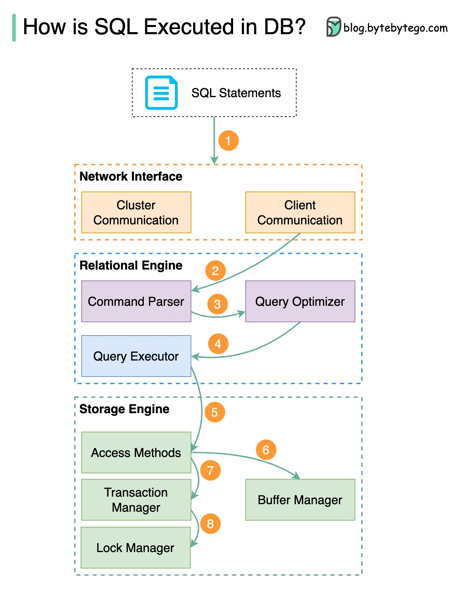

# 数据库中如何执行 SQL 语句？

下面的图表显示了这个过程。请注意，不同数据库的架构是不同的，图表展示了一些常见的设计。第一步 - 通过传输层协议（例如 TCP）将 SQL 语句发送到数据库。第 2 步 - SQL 语句被发送到命令解析器，经过语法和语义分析，然后生成查询树。第三步 - 查询树被发送到优化器。优化器创建执行计划。第 4 步 - 执行计划发送给执行者。执行者从执行中检索数据。第 5 步 - 访问方法提供了执行所需的数据提取逻辑，从存储引擎中检索数据。第 6 步 - 访问方法决定 SQL 语句是否为只读。如果查询是只读的（SELECT 语句），则将其传递给缓冲区管理器进行进一步处理。缓冲区管理器在缓存或数据文件中查找数据。第 7 步 - 如果该语句是 UPDATE 或 INSERT，则将其传递给事务管理器进行进一步处理。第 8 步 - 在交易过程中，数据处于锁定模式。这由锁管理器保证。它还确保了交易的 ACID 属性。