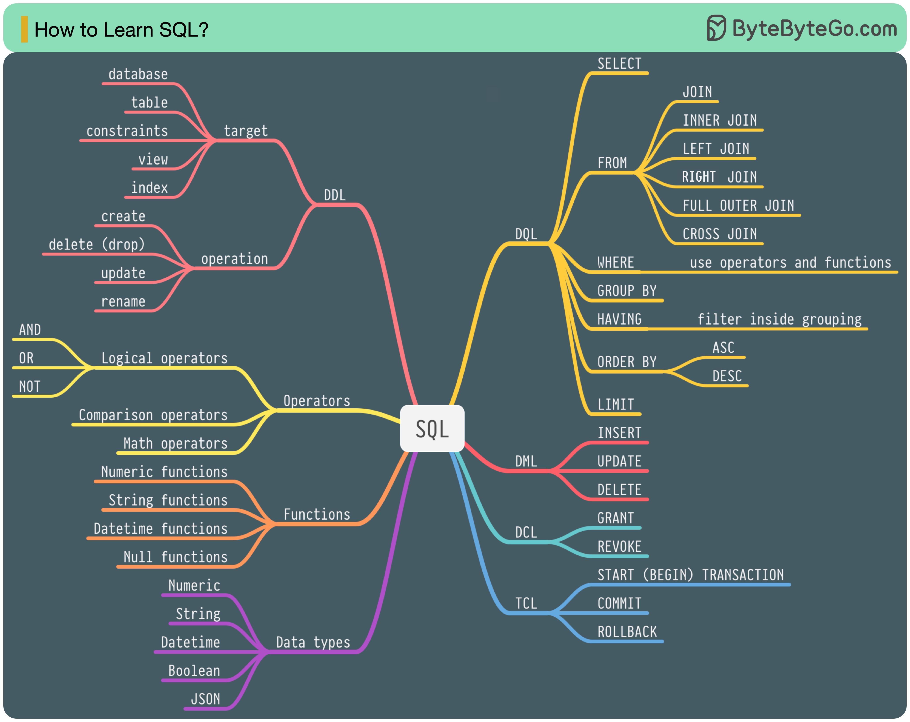

# SQL language

In 1986, SQL (Structured Query Language) became a standard. Over the next 40 years, it became the dominant language for relational database management systems. Reading the latest standard (ANSI SQL 2016) can be time-consuming. How can I learn it?

  

There are 5 components of the SQL language:DDL: data definition language, such as CREATE, ALTER, DROPDQL: data query language, such as SELECTDML: data manipulation language, such as INSERT, UPDATE, DELETEDCL: data control language, such as GRANT, REVOKETCL: transaction control language, such as COMMIT, ROLLBACKFor a backend engineer, you may need to know most of it. As a data analyst, you may need to have a good understanding of DQL. Select the topics that are most relevant to you.