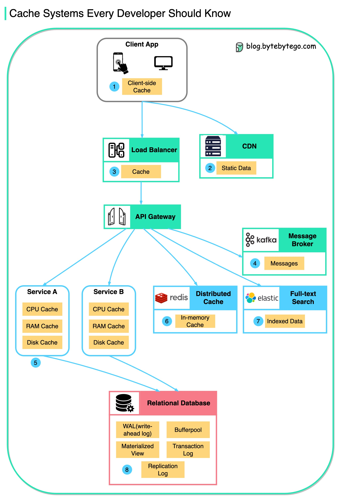

# 数据被缓存在各个地方

这个图表展示了在典型架构中我们缓存数据的位置。有**多个层**沿着流动。客户端应用程序：HTTP 响应可以被浏览器缓存。我们首次通过 HTTP 请求数据，返回的数据中包含 HTTP 头部中的过期策略；再次请求数据时，客户端应用程序会首先尝试从浏览器缓存中检索数据。CDN：CDN 缓存静态网络资源。客户端可以从附近的 CDN 节点检索数据。负载均衡器：负载均衡器可以缓存资源。消息基础设施：消息代理首先将消息存储在磁盘上，然后消费者以自己的速度检索它们。根据保留策略，数据在 Kafka 集群中缓存一段时间。服务：服务中有多个层次的缓存。如果数据未缓存在 CPU 缓存中，服务将尝试从内存中检索数据。有时服务会有第二级缓存，用于将数据存储在磁盘上。分布式缓存：像 Redis 这样的分布式缓存在内存中保存多个服务的键值对。它提供比数据库更好的读写性能。全文搜索：我们有时需要使用全文搜索，如 Elastic Search 用于文档搜索或日志搜索。 数据的副本也被索引在搜索引擎中。数据库：即使在数据库中，我们也有不同级别的缓存：WAL（预写式日志）：数据在构建 B 树索引之前首先写入 WAL缓冲池：分配给缓存查询结果的内存区域物化视图：预先计算查询结果并将其存储在数据库表中，以提高查询性能事务日志：记录所有的交易和数据库更新复制日志：用于记录数据库集群中的复制状态