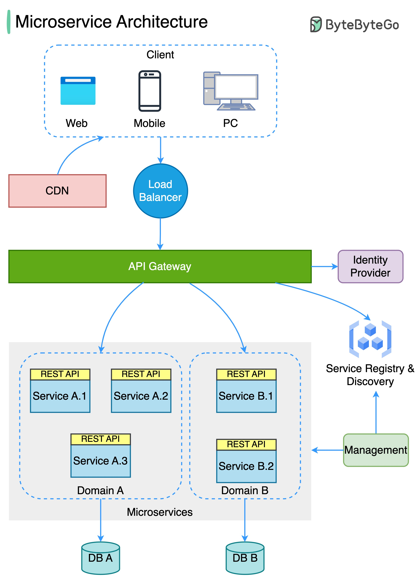

# 典型的微服务架构是什么样的？

下面的图表显示了典型的微服务架构。负载均衡器：这将传入的流量分发到多个后端服务。CDN（内容传送网络）：CDN 是一组地理分布的服务器，用于保存静态内容以实现更快的传送。客户端首先在 CDN 中查找内容，然后再转向后端服务。API 网关：这个处理传入的请求并将它们路由到相关的服务。它与身份提供者和服务发现进行通信。身份提供者：这负责用户的身份验证和授权。服务注册表和发现：微服务的注册和发现发生在这个组件中，API 网关在这个组件中寻找相关服务进行通信。管理：这个组件负责监控服务。微服务：微服务是在不同的领域中设计和部署的。每个领域都有自己的数据库。API 网关通过 REST API 或其他协议与微服务通信，同一领域内的微服务之间使用 RPC（远程过程调用）进行通信。微服务的好处：它们可以快速设计、部署和水平扩展。每个域名都可以由专门的团队独立维护。业务需求可以在每个领域进行定制，并得到更好的支持。