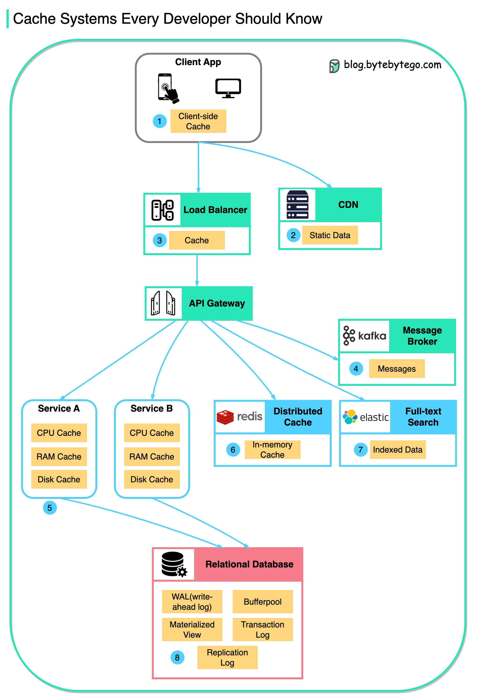

数据被缓存在各个地方这个图表展示了在典型架构中我们缓存数据的位置。有**多个层**沿着流动。客户端应用程序：HTTP 响应可以被浏览器缓存。我们首次通过 HTTP 请求数据，返回的数据中包含 HTTP 头部中的过期策略；再次请求数据时，客户端应用程序会首先尝试从浏览器缓存中检索数据。CDN：CDN 缓存静态网络资源。客户端可以从附近的 CDN 节点检索数据。负载均衡器：负载均衡器可以缓存资源。消息基础设施：消息代理首先将消息存储在磁盘上，然后消费者以自己的速度检索它们。根据保留策略，数据在 Kafka 集群中缓存一段时间。服务：服务中有多个层次的缓存。如果数据未缓存在 CPU 缓存中，服务将尝试从内存中检索数据。有时服务会有第二级缓存，用于将数据存储在磁盘上。分布式缓存：像 Redis 这样的分布式缓存在内存中保存多个服务的键值对。它提供比数据库更好的读写性能。全文搜索：我们有时需要使用全文搜索，如 Elastic Search 用于文档搜索或日志搜索。 数据的副本也被索引在搜索引擎中。数据库：即使在数据库中，我们也有不同级别的缓存：WAL（预写式日志）：数据在构建 B 树索引之前首先写入 WAL缓冲池：分配给缓存查询结果的内存区域物化视图：预先计算查询结果并将其存储在数据库表中，以提高查询性能事务日志：记录所有的交易和数据库更新复制日志：用于记录数据库集群中的复制状态