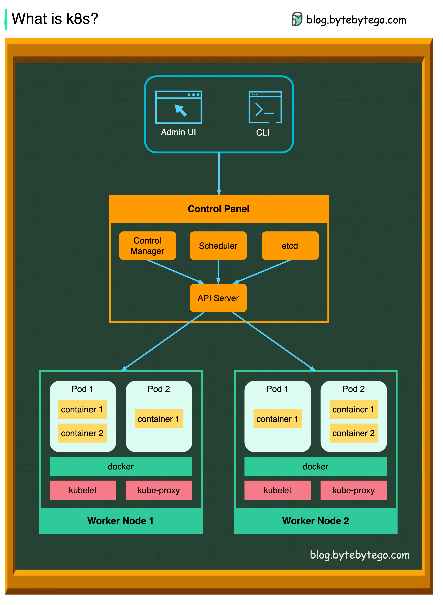

# k8s（Kubernetes）是什么？

K8s 是一个容器编排系统。它用于容器部署和管理。它的设计受到了 Google 内部系统 Borg 的极大影响。一个 k8s 集群由一组运行容器化应用程序的工作机器（称为节点）组成。每个集群至少有一个工作节点。工作节点托管应用程序工作负载的组件 Pods。控制平面管理集群中的工作节点和 Pods。在生产环境中，控制平面通常在多台计算机上运行，并且集群通常运行多个节点，提供容错性和高可用性。控制平面组件API 服务器API 服务器与 k8s 集群中的所有组件进行通信。通过与 API 服务器交谈，对 Pod 上的所有操作都会被执行。调度程序调度程序监视 Pod 工作负载，并将负载分配给新创建的 Pod。控制器管理器控制器管理器运行控制器，包括节点控制器、作业控制器、端点切片控制器和服务账户控制器。Etcdetcd 是一个键值存储，用作 Kubernetes 的后备存储，用于存储所有集群数据。节点豆荚Pod 是一组容器，是 k8s 管理的最小单元。Pod 具有一个单一的 IP 地址，应用于 Pod 内的每个容器。Kubelet在集群中的每个节点上运行的代理。它确保 Pod 中的容器正在运行。Kube 代理Kube-proxy 是在集群中每个节点上运行的网络代理。它将进入节点的流量路由到服务。它将工作请求转发到正确的容器。