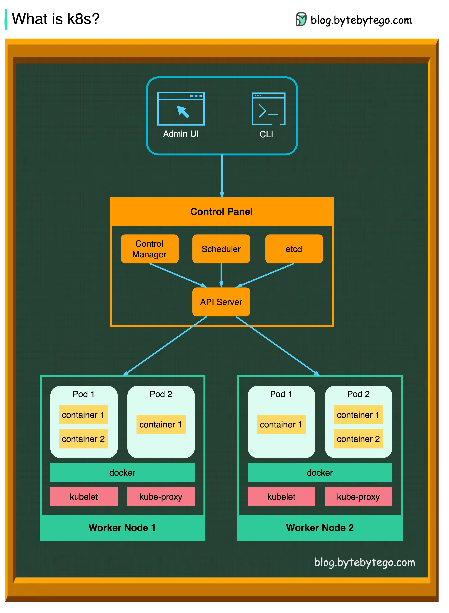

# 什么是k8s（Kubernetes）？

K8s是一个容器编排系统。它用于容器的部署和管理。它的设计受到谷歌内部系统Borg的重大影响。

  

一个k8s集群由一组工作机器（称为节点）组成，这些机器运行容器化应用。每个集群至少有一个工作节点。

工作节点托管Pod，这些Pod是应用工作负载的组成部分。控制平面管理集群中的工作节点和Pods。在生产环境中，控制平面通常跨多个计算机运行，且一个集群通常运行多个节点，以提供容错能力和高可用性。

- 控制平面组件

1. API Server

    API服务器与k8s集群中的所有组件进行通信。所有对Pods的操作都是通过与API服务器交谈来执行的。

2. 调度器

    调度器观察Pod的工作负载，并在新创建的Pods上分配负载。

3. 控制器管理器

    控制器管理器运行控制器，包括节点控制器、任务控制器、端点切片控制器和服务账号控制器。

4. Etcd

    etcd是一个键值存储，用作Kubernetes所有集群数据的后备存储。

- 节点

1. Pods

    Pod是一组容器，是k8s管理的最小单位。每个Pod中每个容器都有一个相同的IP地址。

2. Kubelet

    在集群中的每个节点上运行的代理。它确保Pods中的容器正在运行。

3. Kube Proxy

    Kube-proxy是一种网络代理，运行在集群中每个节点上。它路由从服务进入节点的流量。它将工作请求转发给正确的容器。