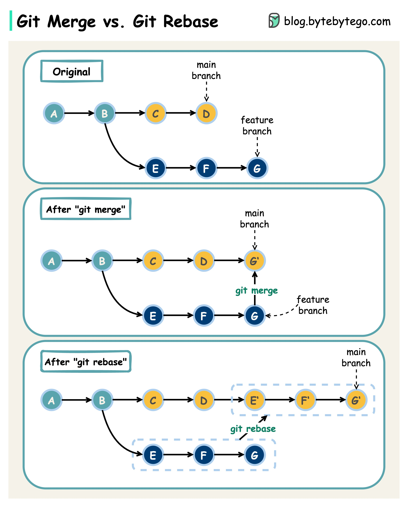

# Git merge vs. Git rebase

What are the differences?

  

When we **merge changes** from one Git branch to another, we can use ‘git merge’ or ‘git rebase’. The diagram below shows how the two commands work.**Git merge**This creates a new commit G’ in the main branch. G’ ties the histories of both main and feature branches.Git merge is **non-destructive**. Neither the main nor the feature branch is changed.**Git rebase**Git rebase moves the feature branch histories to the head of the main branch. It creates new commits E’, F’, and G’ for each commit in the feature branch.The benefit of rebase is that it has a linear **commit history**.Rebase can be dangerous if “the golden rule of git rebase” is not followed.**The Golden Rule of Git Rebase**Never use it on public branches!