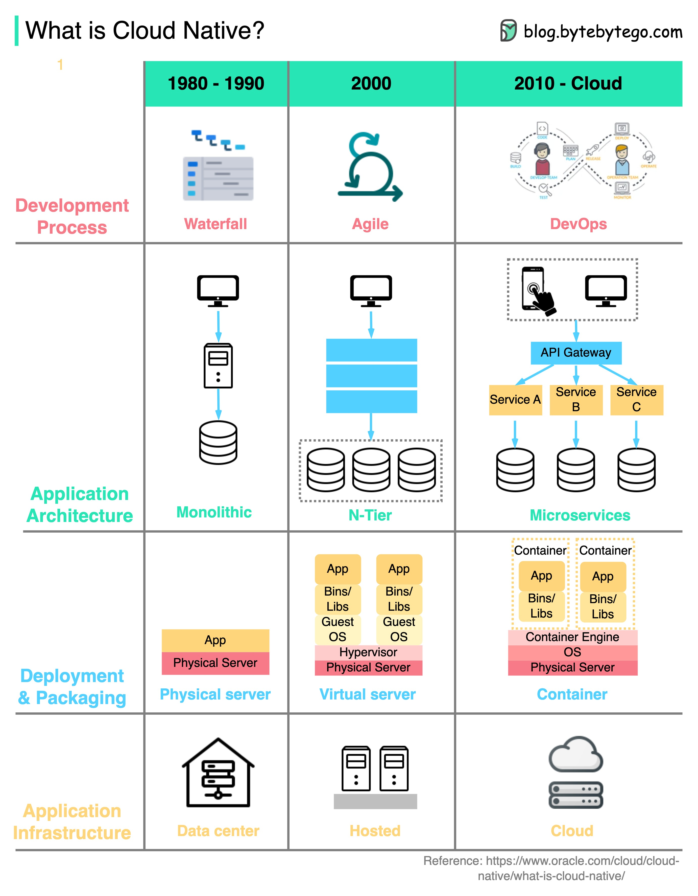

# 什么是云原生？

以下是自 1980 年代以来建筑和流程演变的图表。组织可以利用云原生技术在公共、私有和混合云上构建和运行可扩展的应用程序。这意味着这些应用程序旨在利用云功能，因此它们对负载具有弹性且易于扩展。云原生包括 4 个方面：发展过程这已经从瀑布模型进化到敏捷开发，再到 DevOps。应用架构架构已经从单片到微服务。每个服务都设计为小型，适应云容器中有限的资源。部署和打包应用程序过去部署在物理服务器上。然后大约在 2000 年左右，那些不太敏感于延迟的应用程序通常部署在虚拟服务器上。有了云原生应用程序，它们被打包成 Docker 镜像并部署在容器中。应用基础设施应用程序大规模部署在云基础设施上，而不是自托管服务器上。